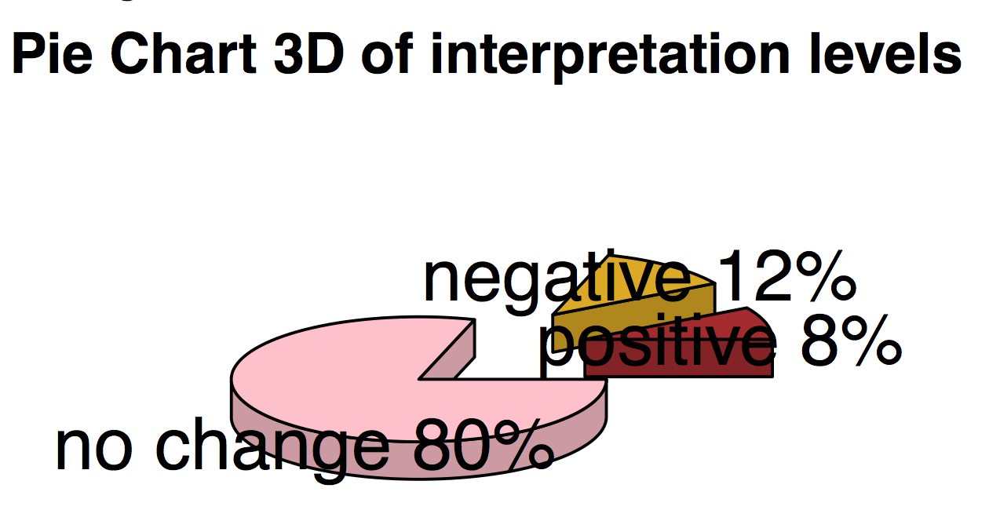
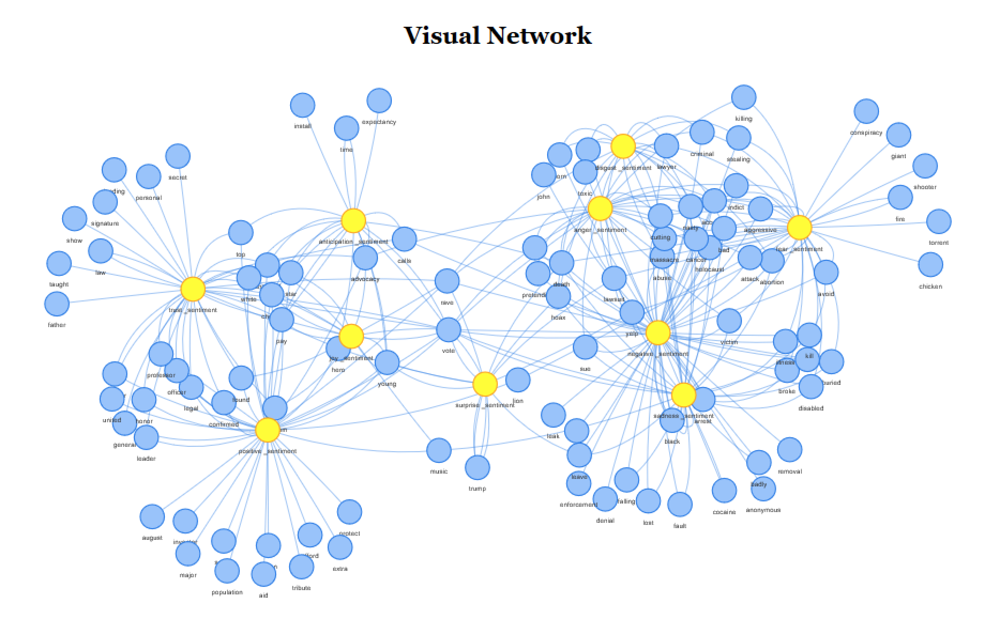
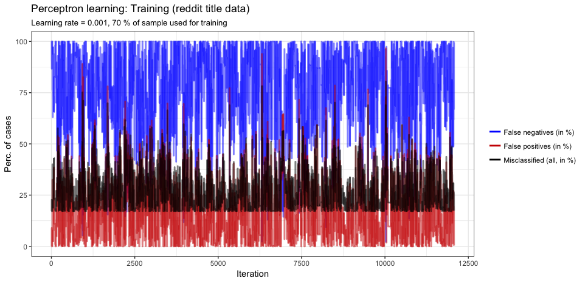

```{r setup, include=FALSE}
knitr::opts_chunk$set(echo = TRUE)
library(readr)
library(ggplot2)
library(tidyverse)
library(dplyr)
library(MASS)
library(modelr)
library(forcats)

library(tidytext)


D <- read_csv("../data/clean_posts_sent.csv")
D2 <- read_csv("../data/clean_posts.csv")
```

\newpage
## Goal

Reddit is a famous American social news aggregation and discussion website with a community of 1.6 billion users. The members post content on the website and it is then voted up or down by other members of the community. This concept is very interesting since it gives a lot of information on what people are interested in and what matters for them at a particular point in time. Thus, it is the reason why we chose to work with Reddit data.  

Given this scope, our group is particularly in the relationship between the features of upvotes, title length and post time in our dataset. This analysis is done in conjunction with a Natural Language Processing (NLP) on the titles, because the title is naturally the main driver of the quality and reach of the post.

`Methodology:`We will apply descriptive statistics to the data to examine the relationships between the features that we are interested in. Then, we will apply sentiment analysis to generate findings on user behavior and the structure of our datasets.

In the third and fourth parts, we apply the perceptron algorithm and a convolutional neural network (CNN) to classify successful and unsuccessful posts based on the features listed above.

The output of the paper gives a great insight in the drivers of the reach of a post and how people post on Reddit.    

## Data

We decided to use one month of Reddit News data. We picked December 2016 for this as it was just after the US elections and that enough time has passed for us to (possibly) notice the effects of news that came out at that time.

Reddit news data usually comes in the form of a title and a link, the title is written by the user and links to the news website's page. It sometimes has thumbnails.

Reddit post data is available on google's bigquery [database](https://bigquery.cloud.google.com/dataset/fh-bigquery:reddit_posts), it is saved in `news_2016_12.csv`. Following are the most relevant columns for our analysis:

* `time_created` (UTC timestamp) - when was the post created
* `author` - username of user that posted
* `domain` - which domain did the news come from?
* `url` - Specific URL of the news post
* `score` : upvotes - downvotes (renamed as `like_score`)
* `upvotes` : how many "likes" the post received
* `downvotes` : howmany "dislikes" the post received
* `title` : user-created title of the post

Due to an issue with the API, no downvote data is given to us. Thus the `score` is equal to the `upvotes` of a post. We will be using the `score` field moving forward.

Furthermore, we thought it would be interesting to compare the difference between the user-generated title and the Actual title posted by the news agency. For this, a (scrapy)[https://scrapy.org/] spider was created to crawl all the (cleaned) URLs and retrieve the title. We think this was rather successful since it retreived `24,045` titles form about `31,713` cleaned posts. This is saved as `titles.csv`.

\newpage
## Task

### Structure of the project

1. Cleaning (in common with the other group)
2. Exploring the data: Descriptive analysis of the data set
3. Introduction of sentiment analysis
4. Prediction of reach with Perceptron and Convolutional network

Due to the size and variety of elements in our dataset, we will apply a variety of methods to extract information, and may use external data to improve our analysis. However, this also implies that the performance measures of our algorithms will vary with the specific relationship under examination.

## 1. Cleaning `[1_clean.r]`

Everything related to cleaning the original dataset is defined in `clean.r`. Essentially, the script:

* saves `utc_created` as a POSIXct variable
* removes special characters from titles
* removes non-english titles, which halves our original dataset.

It creates a csv file that is used by all files.

## 2. Exploring the data: Descriptive analysis of the data set `[2_analysis.r]`

### 2.1 Analysis of comments, upvotes and posts per author:

Since the data is massively skewed, we set the proportion as log10.

```{r echo=FALSE, fig.align="center", fig.height=4, message=FALSE, warning=FALSE}
activity_per_author = D %>% group_by(author) %>% count(author) #checking out many articles
activity_per_author = activity_per_author %>% filter(author!='[deleted]') #cutting out the deleted ones

par(mfrow=c(1,3))

#boxplot(log10(D$num_comments+1), main="Comments", xlab="n = 15400")

#boxplot(log10(D$score+1), main= "Score", xlab = "n = 15400")

#boxplot(log10(activity_per_author$n), main='Posts per author', xlab= "n = 5799")

hist(log10(x=D$num_comments+1),main = "Number of comments", col = 'red', xlab ="log10(Number of Comments + 1)", frequency=FALSE)

hist(log10(x=D$score+1),main = "Number of upvotes", col='red', xlab = "log10(Score Number + 1)", frequency=FALSE)

hist(log10(activity_per_author$n), main = 'Posts per author', col = 'red', xlab = "log10(activity per author)", frequency=FALSE)


```

Interpretation: the plots show a massive skew even though the data’s proportion is `log10`. All ploted variables are right side skewed which shows that the sample consists many low discrete values and marginal number of outliers. This is very important since it has to be taken into consideration in order to adapt the data to get significant results later in this project depending on the models.

### 2.2 Regression: Analyze how activity, here defined as number of comments, influences score.

```{r regression, echo=FALSE, fig.height=3, fig.width=4, message=FALSE, fig.align="center", warning=FALSE}
xlab= 'Number Of Comments'
ylab='Score Number'

ggplot(D) +
  geom_point(aes(num_comments, score), color = "green4") +
  geom_smooth(aes(num_comments, score), method = "lm" ,color = "red3") +
  labs(x = xlab, y = ylab,
       title = "Reg: Comment Number vs. Score Number") +
  theme(title=element_text(size=8, face="bold"),
    axis.text=element_text(size=6),
        axis.title=element_text(size=6,face="bold"))
```

Interpretation: Here, we can see that an additional comment yields on average a 4.9 increase in the score number. The result is statistically significant given the low  p-value of < 2.2e-16.

### 2.3 Regression: Analyze how the time passed influences the number of upvotes.

Explanations: here, we log the number of upvotes because the distance between the different number of upvotes is too high and we don’t get any significant result. We also select only the posts which have more than one upvotes and focus on a one week time period because posts get most of their upvotes in the few days following their post date. This conclusion is based on the cyclicality seen in the data.

```{r echo=FALSE, message=FALSE, fig.height=3, fig.width=4, fig.align="center", warning=FALSE}
D2 <- D2 %>%
  mutate(index_author = 1:nrow(D2))

new_clean_2variables <- D2 %>%
  dplyr::select(ups, time_passed_days) %>%
  filter(time_passed_days < 21) %>%
  filter(ups > 1)  %>%
  mutate(ups = log(ups))

ggplot(new_clean_2variables, aes(x = time_passed_days, y = ups)) +
  geom_point() +
  stat_smooth(method = "lm", col = "red")

```

Interpretation:
For every additional day, a post gets an additional `0.09013` upvote. The result is statistically significant given the `p-value < 0.02902`.


## 3. Sentiment analysis `[3_sentiment.r]`

###  Natural Language Processing with `tidytext`:

In this part, we will use 2 different libraries: NRC and Afinn in order to compute the sentiment of each word of the data set and ultimately be able to compute the sentiment of the different titles. These 2 libraries will be used for two very different purposes, which will be illustrated in the following examples.


### 3.1 Histogram of sentiment analysis of the data set using the Afinn dictionnary

```{r echo=FALSE, fig.height=2, fig.width=5, message=FALSE, fig.align="center", warning=FALSE}

ggplot(D, aes(x=sent_score))+
  geom_histogram(color="black", fill='white')+
  labs(x="Sentiment Score Per Post, n= 15400", y = 'Frequency', title= 'Histogram: Sentiment In The Set')+
  geom_vline(aes(xintercept=mean(D$sent_score), color='mean: -0.1513'), show.legend = TRUE, size=2)+
  geom_vline(aes(xintercept=median(D$sent_score), color='median: 0.0000'), show.legend = TRUE, size=1)+
  geom_vline(aes(xintercept=quantile(D$sent_score,0.25), color='1st quantile: -2.0000'), show.legend = TRUE, size=1)+
  geom_vline(aes(xintercept=quantile(D$sent_score,0.75), color='3rd quantile: 2.0000'), show.legend = TRUE, size=1)

```

Interpretation: The Sentiment of posts is concentrated between -10 and 10. Interestingly posts are are either positive or negative and less often neutral.

### 3.2 Analyze posting behavior with sentiment analysis using Afinn:  
In this part, the goal is to analyze whether people interpret news in a positive or negative way when reposting a news. This is done by analyzing the difference of sentiment level between the source title (title displayed on a news website such as on times.com) and the actual title of the reddit user's post.

Approach: to do this, source titles have been retrieved with the help of their URL, then the sentiment score on both title lists has been calculated with the help of the Afinn lexicon assigning a weight between `-5 < weight < 5` for every word. We chose Afinn because it ranks the sentiment on a scala, making it easier to compare. Finally, the difference has been computed which enables to get some insights as seen in the following graphics: the histogram shows the proportions of posts unchanged, positive or negative while the 3D chart illustrates the percentage of these classes.

```{r echo=FALSE, out.width="200px", fig.align="center", message=FALSE, warning=FALSE}

```

Interpretation:
As observed on the pie chart, most Reddit users (4 out of 5 users) tend to repost exactly the same title that comes from the source title, while 12% of the users in this data set repost it in a negative way (when different in sentiment is negative) and the rest (9%) repost it in a positive way.


### 3.3 Estimation of proportion of each sentiment in reddit titles: how to illustrate sentiment through : Radial dendrogram

There are many ways to represent and analyse the data sets, we decided to explore the beauty of our Reddit dataset in several ways. After extracting sentiment from each word in the title sentence using Saif & Turney (2010) research for NRC dictionary (as research was named after National research Council Canada), which allocates a word into eight sentiment categories. At first, we used a 'visNetwork' library to  create a node-based radial dendrogram. It requires creation of the hierarchy, so we modified our initial sentiment dataset with additional column containing the following hierarchy: Sentiment | Sentiment Detail | Word. The following diagram shows the sentiment allocation for the words used in top 50 posts. 

[It's interactive. Click here to try it out online.](https://pa1nd.github.io/r-datascience-reddit/Radial_NRC_Visual.html)

```{r echo=FALSE, message=FALSE, out.width="200px", fig.align="center"}
knitr::include_graphics("assets/radial_dendrogram.png")
```


### 3.4 How the sentiments are related : network diagram

Secondly, just as in real life there are multiple interpretations, a single word is allocated to the multiple sentiments. To explore this further we create an interactive network, which portrays connections between words and sentiment. Indeed, as seen on the graph below, a single word may be allocated to the multiple sentiments. The emotions associated with either positive or negative sentiment are grouped together, only a "surprise" node is located in the middle linking the words associated with both.


[You can also see the online network diagram here](https://github.com/pA1nD/r-datascience-reddit/blob/master/docs/Network_NRC_Visual.html)
```{r echo=FALSE, message=FALSE, out.width="200px", fig.align="center"}


```

References: 

Saif, M.M. & Turney, P.D. (June, 2010). Emotions Evoked by Common Words and Phrases: Using Mechanical Turk to Create an Emotion Lexicon. Proceedings of the NAACL-HLT 2010 Workshop on Computational Approaches to Analysis and Generation of Emotion in Text. LA, California.  

## 4. Perceptron classification  `[4_models.r]`

### 4.1 Machine learning with Perceptron: prediction of a successful post based on 3 features

Feature 1: sentiment of the post (afinn dictionnary)
Feature 2: length of the post (number of characters)
Feature 3: Posting time (within a day)

In this part, the three features illustrated above will be used to predict whether a post is successful or not. First, we define a successful post as a post getting at least 2 likes.  
This splits the data in successful posts and not successful posts. Then, we prepare the data by assigning every successful post the category 1 and every non successful post the category -1. After this, we keep only the posting time in hours as well as the sentiment of each title. The Training data is then split in 70% training and 30% testing.

### Let's have a look at the training

The result of the perceptron

```{r echo=FALSE, message=FALSE, out.width="200px", fig.align="center"}


```

### Performance of the algorithm

Ratio of misclassified: `17.34` - Given the simple model, it seems surprisingly good.


### 4.2 Convolutional network (CNN) to predict subreddit classification

Natural Language Processing (NLP) can also be done using deep learning. There are various approaches to NLP using CNNs.
As the last point, we will try to use a Deep Neural Network (DNNs) to predict the subreddit classification.

This will build on a example from Microsoft as part of the [Cortana Intelligence Gallery Content](https://github.com/Azure/Cortana-Intelligence-Gallery-Content). After succesfully setting up a classification, we would move on to change the CNN's last layer to perform a regression for likes instead of a classification.

The idea of using deep learning for text classification at character level came first in 2015 with the Crepe model.
After experimenting with multiple approaches, this seems to be a promising way. But as the test shows, both, setting up the right hardware and getting to convergence are big problems.

#### Data and Hardware

We are using a VM on Azure with 4 x K80. And 224 GB Ram. It will take around 5 working days for Microsoft to provide the machine. We use Google BigQuery to download the subreddit data.

[The cnn folder in the github repository](https://github.com/pA1nD/r-datascience-reddit/tree/master/cnn) contains more information about how to access the data and how to setup a server. We hade to fix multiple bugs in Apaches MXNet Makefiles and Microsoft R Server. For GPU support, you have to compile everything from the sources.


#### The model and convergence

We are using a 9 layer deep convolutional neural network. The first 6 layers are convolutional layers. The last 3 are fully connected layers. As activation function, we use ReLu. We use a dropout of 0.5 in each layer. The first Kernel has a size of 7 (average word length).

We use one-hot-encoding to encode sentences and create a matrix along the alphabet. This is known as "Character-level Convolutional Networks for Text Classification" and was first shown in [2015 by Xiang Zhang, Junbo Zhao, Yann LeCun](https://arxiv.org/abs/1509.01626).

After running through 2 million datapoints (~24h), it is not converging, yet in epoch 5.

```
Batch [100] Speed: 494.785492140231 samples/sec Train-accuracy=0.14546875
Batch [200] Speed: 489.140383087916 samples/sec Train-accuracy=0.143837890625
Batch [300] Speed: 488.358155169825 samples/sec Train-accuracy=0.143639322916667
Batch [1100] Speed: 484.049417451275 samples/sec Train-accuracy=0.143199573863636
Batch [2800] Speed: 493.697798574983 samples/sec Train-accuracy=0.142578125
Batch [2900] Speed: 484.230165922307 samples/sec Train-accuracy=0.142456223060345
```
